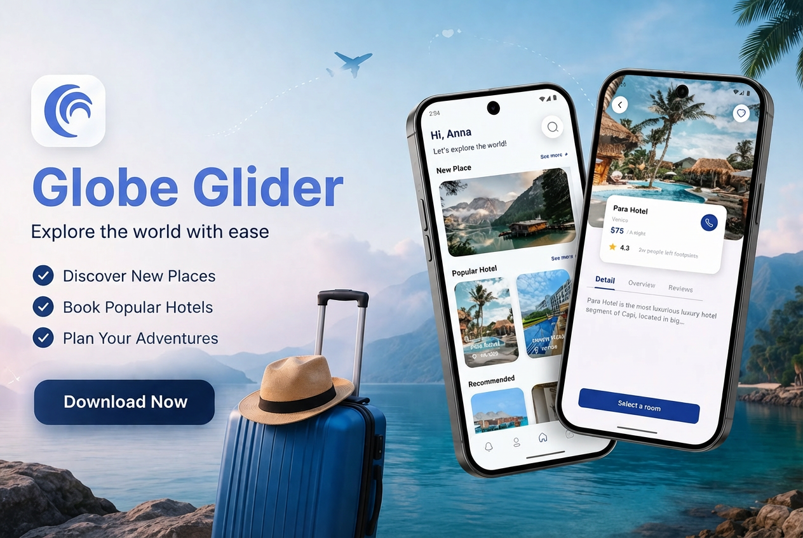
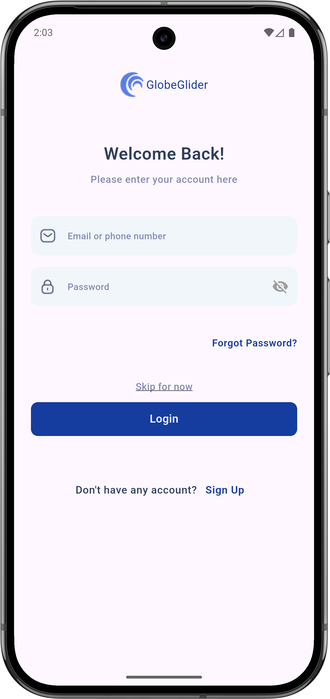
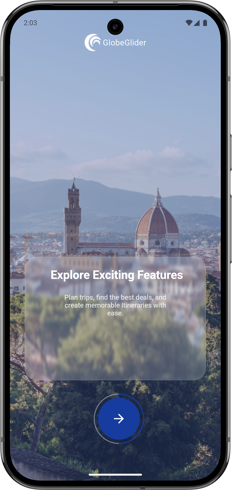
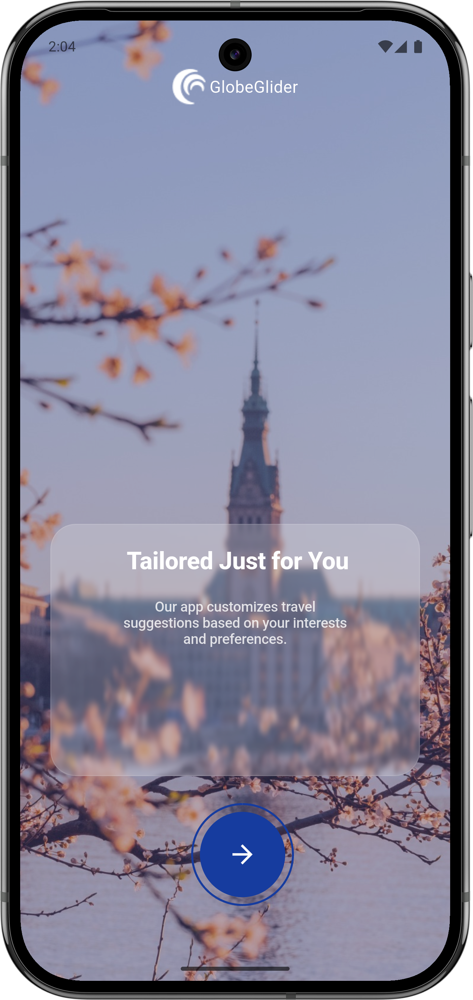
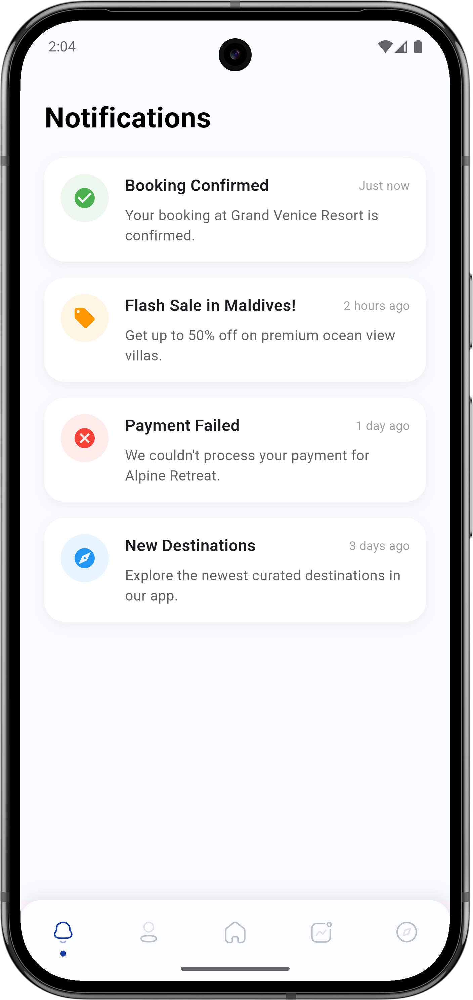
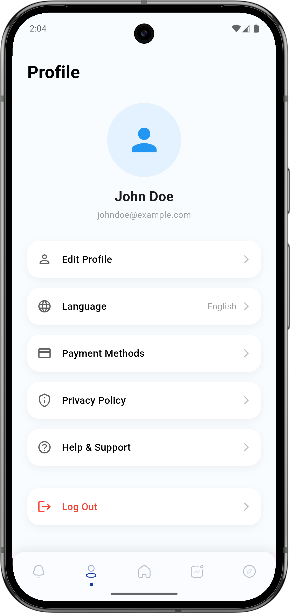
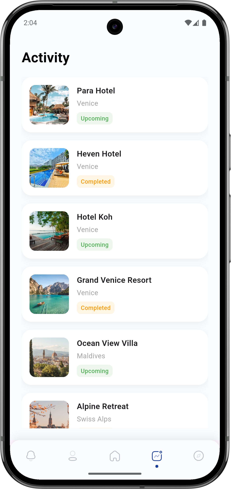
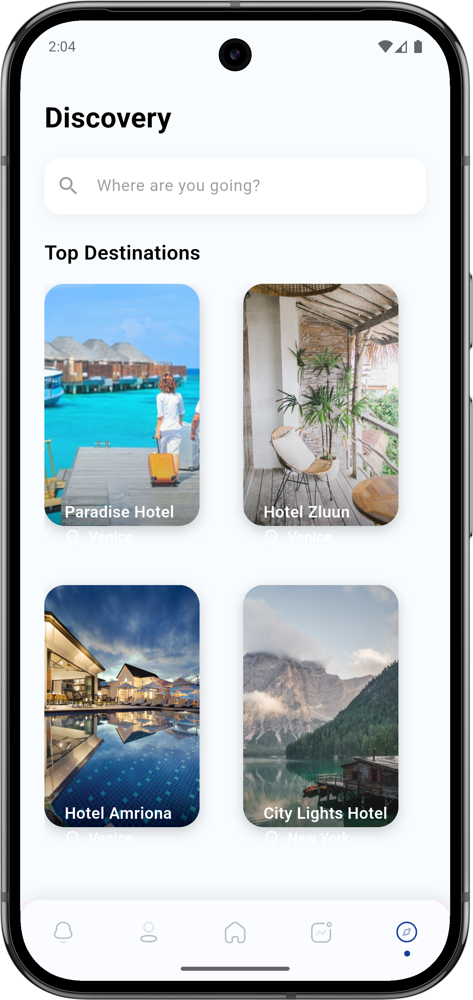
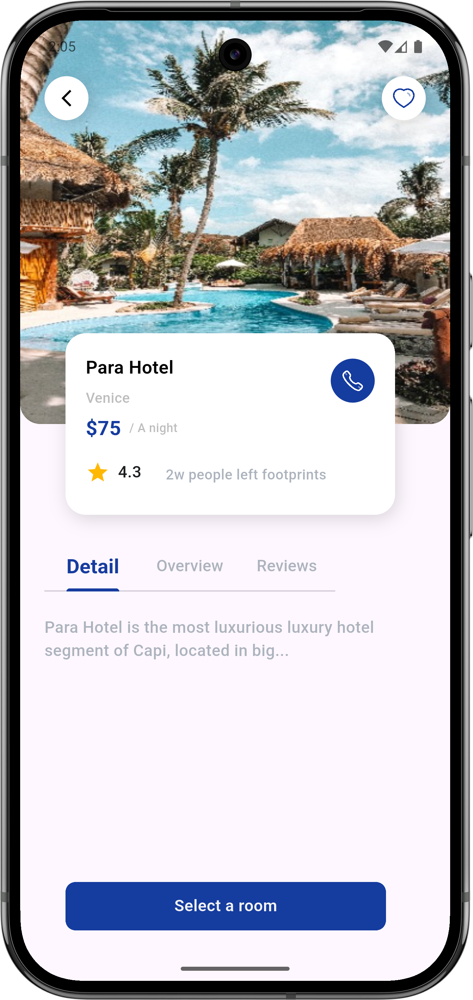

<p align="center">
  
</p>

<h1 align="center">✈️ GlobeGlider — Travel Booking App</h1>

<p align="center">
  A beautifully crafted, fully functional travel booking mobile application built with <strong>Flutter</strong>. Browse trending destinations, plan your trips, and enjoy a seamless discovery experience — all wrapped in a stunning, modern UI.
</p>

<p align="center">
  
  
  
  
</p>

<p align="center">
  <a href="https://travel-app-rho-roan.vercel.app/">
    
  </a>
</p>

---

## ✨ Features

| Feature | Description |
|---------|-------------|
| 🏠 **Home Screen** | Banners, recommended places & curated destinations |
| 🔍 **Discovery** | Browse all travel destinations with search options |
| 🏨 **Place Details** | View full place info with images, pricing, and ratings |
| 🔔 **Notifications** | View activity and alerts |
| 👤 **Profile** | Manage user profile and settings |
| 📅 **Activity** | Clean and interactive booking & activity screens |
| 🔐 **Authentication** | Login and clean authentication flow |
| 🎨 **Onboarding** | Beautiful multi-step introduction screens for new users |
| 🖼️ **Immersive UI** | High-quality visual imagery and glassmorphism elements |

---

## 📸 Screenshots

<p align="center">
  
  
  
  
</p>

<p align="center">
  
  
  
  
</p>

<p align="center">
  
  
</p>

---

## 🏗️ Tech Stack

- **Framework**: Flutter 3.x
- **Language**: Dart
- **UI Components**: Glassmorphism, Google Fonts, Flutter SVG
- **Icons**: Cupertino Icons, Flutter Launcher Icons

---

## 📂 Project Structure

```text
lib/
├── main.dart                  # App entry point
├── constants/                 # App constants & themes
├── pages/                     # Application screens
│   ├── first_page.dart        # Entry/Splash page
│   ├── onboarding/            # Onboarding slides
│   ├── login/                 # Login screens
│   ├── home/                  # Home tab with deals & recommendations
│   ├── discovery_page.dart    # Destination catalog
│   ├── place_details/         # Place detail views & booking
│   ├── activity_page.dart     # User bookings & history
│   ├── notifications_page.dart# Alert & notifications screen
│   └── account_page.dart      # Settings & profile
```

---

## 🚀 Getting Started

### Prerequisites
- Flutter SDK (3.x or later)
- Dart SDK
- Android Studio / VS Code

### Installation

```bash
# Clone the repository
git https://github.com/yadavcodes0/Travel_App.git/
cd Travel_App

# Install dependencies
flutter pub get

# Run the app
flutter run
```

---

## 🤝 Contributing

Contributions, issues, and feature requests are welcome! Feel free to open an issue or submit a pull request.

---

## 📄 License

This project is licensed under the MIT License.

---

<p align="center">
  Made with ❤️ using Flutter
</p>
